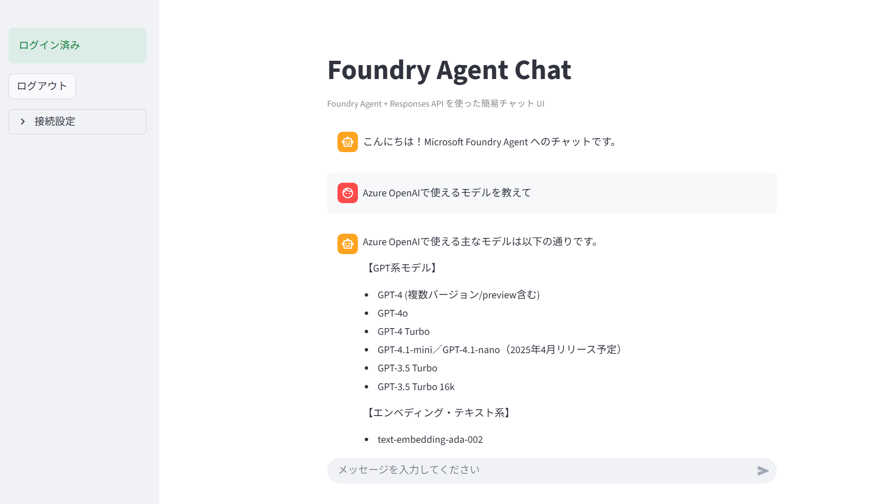

# rag-chat-sample

Azure AI Foundry Agent を Streamlit UI から操作するサンプルです。ログイン付きのシンプルなチャット画面を提供し、Azure AI Project と接続して回答を生成します。



## 必要な環境

- Python3.10 以降
- `pip install -r requirements.txt` で依存を導入
- `.env_template` を `.env` にコピーして以下の値を設定（ローカル実行・デプロイ共通）
  - `APP_LOGIN_USERNAME` / `APP_LOGIN_PASSWORD`: Streamlit ログイン用の認証情報
  - `AZURE_AI_PROJECT_ENDPOINT`: 接続先 Azure AI Project のエンドポイント URL
  - `AZURE_AI_AGENT_NAME`: 呼び出すエージェント名

## ローカル実行

```bash
python -m venv .venv
source .venv/bin/activate  # Windows は .venv\Scripts\activate
pip install -r requirements.txt
streamlit run app.py
```

## Azure App Service へのデプロイ

前提として Azure Portal 側で App Service を作成し、`.env`に必要な値を設定しておきます。`scripts/startup.sh`はデフォルトで`streamlit run app.py --server.port $PORT --server.address 0.0.0.0`を実行する想定です。必要に応じて修正してください。

### Linux / macOS: `scripts/deploy.sh`

1. `scripts/deploy.sh` の先頭で定義している `RG` / `LOC` / `WEBAPP` を自分の環境に合わせて変更
2. 実行権限を付与してシェルから実行

```bash
chmod +x scripts/deploy.sh
./scripts/deploy.sh
```

### Windows: `scripts/deploy.ps1`

1. PowerShell で`scripts/deploy.ps1`を開き、`$RG` / `$Loc` / `$WebApp`を自分のリソース名に合わせる
2. 以下のいずれかの方法で実行

**方法 1: コマンドプロンプトまたはエクスプローラーから実行（推奨）**

```cmd
scripts\deploy.cmd
```

**方法 2: PowerShell から直接実行**

```powershell
powershell.exe -ExecutionPolicy RemoteSigned -File scripts\deploy.ps1
```

**方法 3: PowerShell 7 (pwsh) がインストールされている場合**

```powershell
pwsh -File scripts/deploy.ps1
```

> **ヒント**: `pwsh` コマンドが見つからないエラーが発生した場合は、方法 1 または方法 2 を使用してください。PowerShell 7 のインストールは任意です。

### 両スクリプトが実行する内容

- `.env` の読み込みと必須値チェック
- リポジトリを `deploy.zip` に圧縮
- `az login`（未ログイン時）
- App Service のアプリ設定更新
  - `APP_LOGIN_USERNAME`, `APP_LOGIN_PASSWORD`
  - `AZURE_AI_PROJECT_ENDPOINT`, `AZURE_AI_AGENT_NAME`
  - `SCM_DO_BUILD_DURING_DEPLOYMENT`, `WEBSITES_PORT`
- スタートアップコマンド（`bash scripts/startup.sh`）の設定
- `az webapp deploy`による Zip Deploy

両スクリプトともログ出力とエラーメッセージは日本語化済みです。必要に応じて `.env` の値や `scripts/deploy.*` 内の設定を変更してご利用ください。

## エージェント作成スクリプト（`scripts/create_agent.py`）

Azure AI Foundry 側で MCP 接続付きエージェントを作成・更新する補助スクリプトです。実行すると以下を順に行います。

1. `scripts/.env`の値を読み込み、指定された URL/Resource ID/エージェント名を検証
2. 管理 API に対して Project Managed Identity 接続を作成（存在する場合は更新）
3. Azure AI Projects SDK を使って MCP ツールを紐付けたエージェントの新バージョンを作成

### 使い方

1. `scripts/.env_template` を `scripts/.env` にコピーし、各値を自分のリソース名に置き換えます。
2. ルート直下で依存をインストールしていない場合は `pip install -r requirements.txt` を実行します。
3. 下記コマンドでスクリプトを起動します。

```bash
cd scripts
python create_agent.py
```

Azure CLI などですでにログイン済みで、Managed Identity かサービスプリンシパルに適切な権限がある必要があります。`PROJECT_CONNECTION_NAME`を`.env`で省略した場合は、自動的に 8 文字の UUID 片が利用されます。
